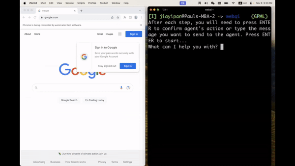

# [👀🧠GPT-4 Vision](https://openai.com/research/gpt-4v-system-card) x [💪⌨️Vimium](https://github.com/philc/vimium) = Autonomous Web Agent


**Demo Video: GPT-4V finds a cute cat image through Chrome.**

This project leverages GPT4V to create an autonomous / interactive web agent. The action space are discretized by [Vimium](https://github.com/philc/vimium).

It's a minimal proof-of-concept project at the current stage and performance can be furhter improved with more engineering.

## Get Started
**Install**
```bash
# For Mac users
brew install chromedriver  
# run `brew upgrade chromedriver` if you already have it
pip install git+https://github.com/Jiayi-Pan/GPT-V-on-Web.git
```

**Run**
```bash
webai
# or if you want start at a specific website
webai --start_link "https://www.google.com"
```
## Related Works
- [GPT-4V-Act](https://github.com/ddupont808/GPT-4V-Act)
